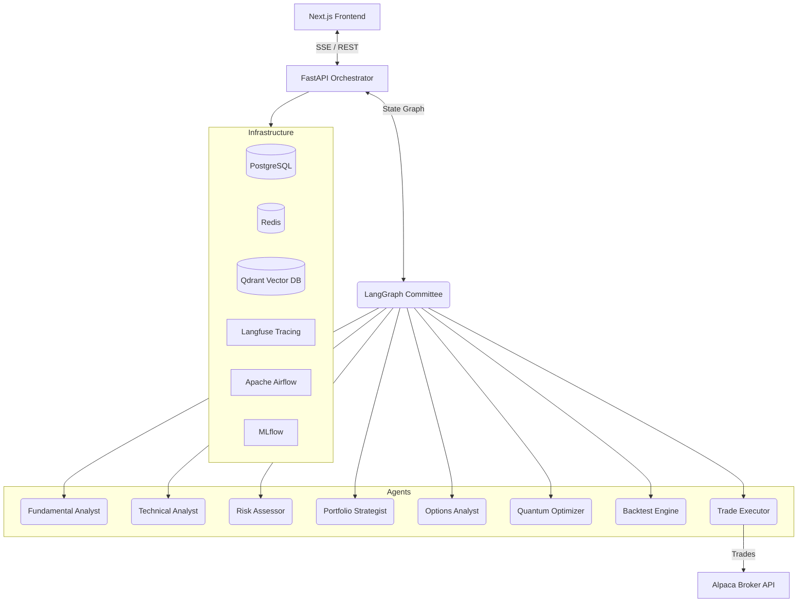

<div align="center">
  
  <h1>QuantAgents</h1>
  <p><strong>A Multi-Agent Trading Intelligence Platform with Quantum-Enhanced Portfolio Optimization</strong></p>
  
  <p>
    <a href="#architecture"></a>
    <a href="#frontend"></a>
    <a href="#backend"></a>
    <a href="#quantum"></a>
    <a href="#infrastructure"></a>
  </p>
</div>

<br />

## 🚀 Overview

**QuantAgents** is an autonomous 8-agent trading intelligence committee built on LangGraph. The platform orchestrates specialized AI agents (using GPT-4) to collaboratively research equities, debate findings via adversarial critique loops, execute paper trades on Alpaca, and optimize asset allocation using IBM Qiskit Quantum algorithms.

The system features dual-layer memory (Redis for episodic short-term, Qdrant for semantic long-term) allowing the committee to learn from past trades and prediction accuracy, effectively getting smarter with every transaction through RL-based reward tracking.

### 🌟 Key Features
- **8-Agent Committee**: Specialized node agents including Fundamental Analyst, Technical Analyst, Risk Assessor, Portfolio Strategist, Options Analyst, Quantum Optimizer, Backtester, and Trade Executor.
- **Quantum Optimization**: Integrates IBM Qiskit (QAOA algorithm) for advanced efficient-frontier portfolio rebalancing.
- **Options Pricing & ML**: Includes Black-Scholes pricing variants with XGBoost + Optuna ML models for confidence calibration.
- **Dual-Memory RAG**: Retains historical market conditions and trade rationale.
- **Real-Time Streaming**: Native Server-Sent Events (SSE) stream agent debate logs and status updates directly to the frontend.
- **Glassmorphism UI**: A gorgeous, modern Next.js + Tailwind React frontend with Recharts analytics.
- **Production CI/CD**: 5 complete GitHub Actions workflows tracking unit tests, ML model training, system bias limits, and auto-deployments.

---

## 🏗️ Architecture



---

## 💻 Tech Stack

- **Frontend**: Next.js 16 (App Router), React 19, Tailwind CSS v4, Framer Motion, Recharts
- **Backend**: Python 3.12, FastAPI, LangGraph, LangChain, SQLAlchemy (Async), Alembic
- **Machine Learning / Quant**: Scikit-Learn, XGBoost, Optuna, VectorBT, IBM Qiskit, SHAP, LIME
- **Data Pipeline**: Apache Airflow, Great Expectations, DVC
- **Observability & MLOps**: Langfuse (LLM Tracing), MLflow (Model Registry)
- **Infrastructure**: Docker Compose, PostgreSQL 16, Redis 7, Qdrant
- **Tools / MCP**: Alpaca API, Tavily Search, Alpha Vantage, SEC EDGAR

---

## 🚀 Getting Started

### Prerequisites
- Docker and Docker Compose
- Node.js 20+
- `uv` Python package manager (`pip install uv`)
- Required API Keys: OpenAI, Alpaca, Tavily, Alpha Vantage.

### Local Installation

1. **Clone the repository**
   ```bash
   git clone https://github.com/sriksven/quantagents.git
   cd quantagents
   ```

2. **Environment Variables**
   Duplicate `.env.example` in `backend/.env` and `frontend/.env.local` and populate your keys.
   ```bash
   cp .env.example backend/.env
   ```

3. **Start the Infrastructure Container Stack**
   ```bash
   docker compose up -d
   ```
   *This starts PostgreSQL, Redis, Qdrant, Langfuse, Airflow, and MLflow.*

4. **Run Database Migrations**
   ```bash
   cd backend
   uv run alembic upgrade head
   ```

5. **Start Backend & Frontend Services**
   ```bash
   # Terminal 1: Backend
   cd backend
   uv run uvicorn main:app --reload

   # Terminal 2: Frontend
   cd frontend
   npm run dev
   ```

6. Open `http://localhost:3000` to access the Analysis Console.

---

## 🧪 CI/CD & Testing

The platform enforces strict quality gates via **GitHub Actions**:
1. **Tests & Linting**: 170+ Pytest assertions spanning agents, core logic, ML models, and memory.
2. **Data Pipeline**: Airflow E2E simulation tests.
3. **Model Training**: Auto-triggers hyperparameter sweeps on new commits to the `models/` directory.
4. **Bias Detection**: Halts the pipeline if the ML Calibration model exhibits >5% bias across 6 tracking dimensions.
5. **Deployment**: Pushes to Railway with `--force-rollback` safety nets.

To run tests locally:
```bash
cd backend
uv run pytest tests/ -v
```

---

## 📝 License

Distributed under the MIT License. See `LICENSE` for more information.

---
<div align="center">
  <i>Built by <a href="https://github.com/sriksven">Sriks</a>.</i>
</div>
